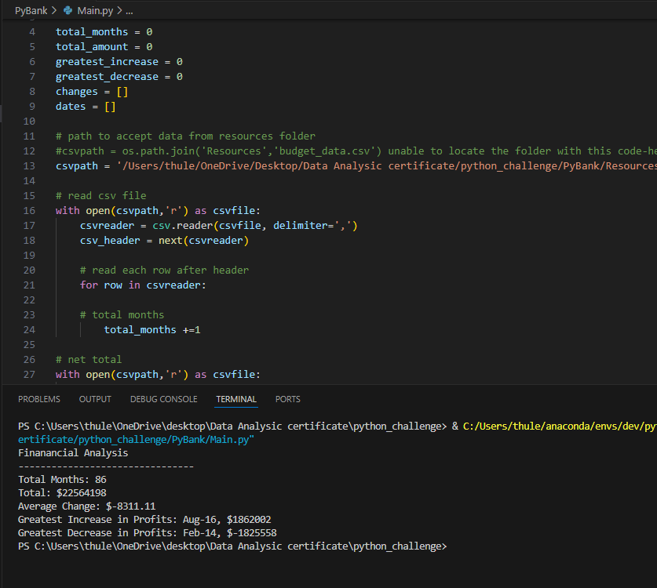

Python Challenge

PyBank: Analyze the financial records of the company.
Technologies Used: VS Code, Xpert Learning Assistant, chatGPT, and Python.
A financial analysis of the company was performed by iterating through the dataset. This process involved calculating the total number of months covered by the data, the net total of profits and losses, the average change in profits and losses, and identifying the date and value of the greatest increase and decrease in profits. The results were consolidated and saved to Financial Analysis.txt in the Analysis folder.

PyPoll: Analyze election votes.
Technologies Used: VS Code, Xpert Learning Assistant, chatGPT, and Python.
The election analysis was conducted by iterating through all submitted votes. This process involved calculating the total number of votes cast, as well as the vote count and percentage for each candidate. The winning result was determined and all findings were documented in Election results.txt within the Analysis folder.
